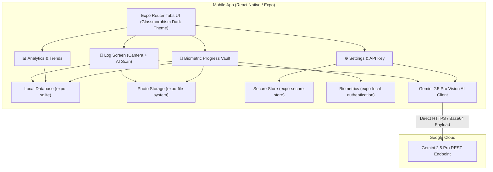

# FUEL Native Mobile App Implementation Plan

> **For agentic workers:** REQUIRED SUB-SKILL: Use superpowers:subagent-driven-development to implement this plan task-by-task. Steps use checkbox (`- [ ]`) syntax for tracking.

**Goal:** Build a native, standalone iOS & Android mobile application for FUEL using React Native (Expo), TypeScript, local SQLite database, biometric progress vault, and Gemini 2.5 Pro Vision AI.

**Architecture:** The application runs 100% on-device with zero required backend servers. Data is persisted locally in SQLite (`expo-sqlite`) and photos in private sandboxed storage (`expo-file-system`). Meal nutrition analysis connects directly and securely from device to Google Gemini 2.5 Pro Vision API.

**Architecture Diagram:**


**Tech Stack:**
- React Native / Expo (SDK 52+), TypeScript
- Expo Router (File-based navigation)
- NativeWind / Tailwind CSS + React Native Reanimated
- Local SQLite (`expo-sqlite`)
- Storage & Camera (`expo-file-system`, `expo-image-picker`, `expo-camera`)
- Security (`expo-secure-store`, `expo-local-authentication`)
- Charts (`react-native-gifted-charts` / SVG)
- AI Engine (`gemini-2.5-pro` with structured JSON output)

**Spec:** [`docs/superpowers/specs/2026-09-23-fuel-native-mobile-app-design.md`](file:///D:/Project/fitness-tracker/docs/superpowers/specs/2026-09-23-fuel-native-mobile-app-design.md)

## Global Constraints
- Use `gemini-2.5-pro` for meal image analysis.
- 100% on-device data storage — no external server requirements.
- Full TypeScript type annotations across all files (no `any`).
- No placeholders (`TODO`, `TBD`, "add error handling") — write actual production-ready code.
- Write automated tests using `jest` and `@testing-library/react-native`.

---

### Task 1: Expo App Scaffolding, Navigation Layout & Theme System

**Files:**
- Create: `package.json`
- Create: `app.json`
- Create: `tsconfig.json`
- Create: `tailwind.config.js`
- Create: `constants/theme.ts`
- Create: `app/_layout.tsx`
- Create: `tests/theme.test.ts`

**Interfaces:**
- Produces: `constants/theme.ts` exporting `COLORS`, `SPACING`, `TYPOGRAPHY`
- Produces: `app/_layout.tsx` root stack layout with dark theme provider

- [ ] **Step 1: Create package.json and project configuration**
Create `package.json` with Expo dependencies:
```json
{
  "name": "fuel-fitness",
  "version": "1.0.0",
  "main": "expo-router/entry",
  "scripts": {
    "start": "expo start",
    "android": "expo start --android",
    "ios": "expo start --ios",
    "web": "expo start --web",
    "test": "jest"
  },
  "dependencies": {
    "expo": "~52.0.0",
    "expo-router": "~4.0.0",
    "expo-status-bar": "~2.0.0",
    "expo-sqlite": "~15.0.0",
    "expo-file-system": "~18.0.0",
    "expo-image-picker": "~16.0.0",
    "expo-camera": "~16.0.0",
    "expo-secure-store": "~14.0.0",
    "expo-local-authentication": "~15.0.0",
    "expo-haptics": "~14.0.0",
    "react": "18.3.1",
    "react-native": "0.76.0",
    "react-native-reanimated": "~3.16.0",
    "react-native-safe-area-context": "4.12.0",
    "react-native-screens": "~4.1.0",
    "react-native-svg": "15.8.0",
    "lucide-react-native": "^0.460.0",
    "clsx": "^2.1.1",
    "tailwind-merge": "^2.5.4"
  },
  "devDependencies": {
    "@babel/core": "^7.25.2",
    "@types/jest": "^29.5.14",
    "@types/react": "~18.3.12",
    "jest": "^29.7.0",
    "jest-expo": "~52.0.0",
    "typescript": "~5.3.3"
  }
}
```

- [ ] **Step 2: Write tests for theme constants**
Create `tests/theme.test.ts`:
```typescript
import { COLORS } from '../constants/theme';

describe('Theme Constants', () => {
  it('defines the core dark mode colors', () => {
    expect(COLORS.background).toBe('#0D0D0D');
    expect(COLORS.card).toBe('rgba(26, 26, 26, 0.7)');
    expect(COLORS.primary).toBe('#06B6D4');
    expect(COLORS.secondary).toBe('#4F46E5');
  });
});
```

- [ ] **Step 3: Run test to verify it fails**
Run: `npx jest tests/theme.test.ts`
Expected: FAIL (Cannot find module `constants/theme`)

- [ ] **Step 4: Implement theme constants and root layout**
Create `constants/theme.ts`:
```typescript
export const COLORS = {
  background: '#0D0D0D',
  card: 'rgba(26, 26, 26, 0.7)',
  cardBorder: 'rgba(255, 255, 255, 0.08)',
  primary: '#06B6D4',
  secondary: '#4F46E5',
  success: '#10B981',
  warning: '#F59E0B',
  danger: '#EF4444',
  text: '#F9FAFB',
  textSecondary: '#9CA3AF',
  textMuted: '#6B7280',
};

export const SPACING = {
  xs: 4,
  sm: 8,
  md: 16,
  lg: 24,
  xl: 32,
};
```

Create `app/_layout.tsx`:
```tsx
import { Stack } from 'expo-router';
import { StatusBar } from 'expo-status-bar';
import { SafeAreaProvider } from 'react-native-safe-area-context';
import { COLORS } from '../constants/theme';

export default function RootLayout(): JSX.Element {
  return (
    <SafeAreaProvider style={{ backgroundColor: COLORS.background }}>
      <StatusBar style="light" />
      <Stack
        screenOptions={{
          headerShown: false,
          contentStyle: { backgroundColor: COLORS.background },
        }}
      >
        <Stack.Screen name="(tabs)" options={{ headerShown: false }} />
      </Stack>
    </SafeAreaProvider>
  );
}
```

- [ ] **Step 5: Run tests to verify they pass**
Run: `npx jest tests/theme.test.ts`
Expected: PASS

- [ ] **Step 6: Commit**
```bash
git add package.json app.json tsconfig.json constants/ app/_layout.tsx tests/theme.test.ts
git commit -m "feat: setup expo mobile scaffolding, root layout, and theme tokens"
```

---

### Task 2: Local Database (SQLite) & Photo Storage Engine

**Files:**
- Create: `db/database.ts`
- Create: `services/storage.ts`
- Create: `types/fitness.ts`
- Create: `tests/database.test.ts`

**Interfaces:**
- Produces: `types/fitness.ts` (`FitnessLogEntry`, `NewFitnessLog`)
- Produces: `db/database.ts` (`initDatabase()`, `saveLogEntry()`, `getLogEntries()`, `getDailyStats()`)
- Produces: `services/storage.ts` (`savePhotoLocally()`, `deleteLocalPhoto()`)

- [ ] **Step 1: Define fitness data types**
Create `types/fitness.ts`:
```typescript
export type MealType = 'Breakfast' | 'Lunch' | 'Dinner' | 'Snack';

export interface FitnessLogEntry {
  id: number;
  timestamp: string;
  date: string;
  meal_type: MealType;
  calories: number;
  protein_g: number;
  carbs_g: number;
  fat_g: number;
  weight_kg: number | null;
  workout_notes: string | null;
  wind_down: string | null;
  ai_feedback: string[];
  meal_photo_uri: string | null;
  progress_photo_uri: string | null;
  created_at: string;
}

export interface NewFitnessLog {
  timestamp: string;
  date: string;
  meal_type: MealType;
  calories: number;
  protein_g: number;
  carbs_g: number;
  fat_g: number;
  weight_kg?: number | null;
  workout_notes?: string | null;
  wind_down?: string | null;
  ai_feedback: string[];
  meal_photo_uri?: string | null;
  progress_photo_uri?: string | null;
}
```

- [ ] **Step 2: Write tests for database and storage helpers**
Create `tests/database.test.ts`:
```typescript
import { formatLogForStorage, parseDbRowToLog } from '../db/database';
import { NewFitnessLog } from '../types/fitness';

describe('Database Formatting Helpers', () => {
  it('correctly serializes feedback array to JSON string', () => {
    const entry: NewFitnessLog = {
      timestamp: '2026-09-23T10:00:00Z',
      date: '2026-09-23',
      meal_type: 'Lunch',
      calories: 550,
      protein_g: 45,
      carbs_g: 50,
      fat_g: 15,
      weight_kg: 72.5,
      workout_notes: 'Chest day',
      wind_down: 'Reading',
      ai_feedback: ['✅ High protein', '💡 Add veggies'],
    };

    const formatted = formatLogForStorage(entry);
    expect(formatted.ai_feedback).toBe('["✅ High protein","💡 Add veggies"]');
    expect(formatted.calories).toBe(550);
  });

  it('correctly parses database row into typed FitnessLogEntry', () => {
    const row = {
      id: 1,
      timestamp: '2026-09-23T10:00:00Z',
      date: '2026-09-23',
      meal_type: 'Lunch',
      calories: 550,
      protein_g: 45,
      carbs_g: 50,
      fat_g: 15,
      weight_kg: 72.5,
      workout_notes: 'Chest day',
      wind_down: 'Reading',
      ai_feedback: '["✅ High protein","💡 Add veggies"]',
      meal_photo_uri: 'file:///photo.jpg',
      progress_photo_uri: null,
      created_at: '2026-09-23 10:00:00',
    };

    const parsed = parseDbRowToLog(row);
    expect(parsed.ai_feedback).toEqual(['✅ High protein', '💡 Add veggies']);
    expect(parsed.calories).toBe(550);
    expect(parsed.progress_photo_uri).toBeNull();
  });
});
```

- [ ] **Step 3: Run test to verify it fails**
Run: `npx jest tests/database.test.ts`
Expected: FAIL

- [ ] **Step 4: Implement Database layer and File Storage**
Create `db/database.ts`:
```typescript
import * as SQLite from 'expo-sqlite';
import { FitnessLogEntry, NewFitnessLog } from '../types/fitness';

let dbInstance: SQLite.SQLiteDatabase | null = null;

export async function getDb(): Promise<SQLite.SQLiteDatabase> {
  if (!dbInstance) {
    dbInstance = await SQLite.openDatabaseAsync('fuel_fitness.db');
    await initDatabase(dbInstance);
  }
  return dbInstance;
}

export async function initDatabase(db: SQLite.SQLiteDatabase): Promise<void> {
  await db.execAsync(`
    CREATE TABLE IF NOT EXISTS fitness_logs (
      id INTEGER PRIMARY KEY AUTOINCREMENT,
      timestamp TEXT NOT NULL,
      date TEXT NOT NULL,
      meal_type TEXT NOT NULL,
      calories REAL NOT NULL DEFAULT 0.0,
      protein_g REAL NOT NULL DEFAULT 0.0,
      carbs_g REAL NOT NULL DEFAULT 0.0,
      fat_g REAL NOT NULL DEFAULT 0.0,
      weight_kg REAL,
      workout_notes TEXT,
      wind_down TEXT,
      ai_feedback TEXT,
      meal_photo_uri TEXT,
      progress_photo_uri TEXT,
      created_at DATETIME DEFAULT CURRENT_TIMESTAMP
    );
    CREATE INDEX IF NOT EXISTS idx_logs_date ON fitness_logs(date);
    CREATE TABLE IF NOT EXISTS user_settings (
      key TEXT PRIMARY KEY,
      value TEXT NOT NULL
    );
  `);
}

export function formatLogForStorage(entry: NewFitnessLog) {
  return {
    ...entry,
    ai_feedback: JSON.stringify(entry.ai_feedback || []),
    weight_kg: entry.weight_kg ?? null,
    workout_notes: entry.workout_notes ?? null,
    wind_down: entry.wind_down ?? null,
    meal_photo_uri: entry.meal_photo_uri ?? null,
    progress_photo_uri: entry.progress_photo_uri ?? null,
  };
}

export function parseDbRowToLog(row: any): FitnessLogEntry {
  let feedback: string[] = [];
  try {
    feedback = typeof row.ai_feedback === 'string' ? JSON.parse(row.ai_feedback) : [];
  } catch {
    feedback = [];
  }
  return {
    id: row.id,
    timestamp: row.timestamp,
    date: row.date,
    meal_type: row.meal_type,
    calories: Number(row.calories) || 0,
    protein_g: Number(row.protein_g) || 0,
    carbs_g: Number(row.carbs_g) || 0,
    fat_g: Number(row.fat_g) || 0,
    weight_kg: row.weight_kg !== null ? Number(row.weight_kg) : null,
    workout_notes: row.workout_notes || null,
    wind_down: row.wind_down || null,
    ai_feedback: feedback,
    meal_photo_uri: row.meal_photo_uri || null,
    progress_photo_uri: row.progress_photo_uri || null,
    created_at: row.created_at || row.timestamp,
  };
}

export async function saveLogEntry(entry: NewFitnessLog): Promise<number> {
  const db = await getDb();
  const data = formatLogForStorage(entry);
  const result = await db.runAsync(
    `INSERT INTO fitness_logs (
      timestamp, date, meal_type, calories, protein_g, carbs_g, fat_g,
      weight_kg, workout_notes, wind_down, ai_feedback, meal_photo_uri, progress_photo_uri
    ) VALUES (?, ?, ?, ?, ?, ?, ?, ?, ?, ?, ?, ?, ?)`,
    [
      data.timestamp,
      data.date,
      data.meal_type,
      data.calories,
      data.protein_g,
      data.carbs_g,
      data.fat_g,
      data.weight_kg,
      data.workout_notes,
      data.wind_down,
      data.ai_feedback,
      data.meal_photo_uri,
      data.progress_photo_uri,
    ]
  );
  return result.lastInsertRowId;
}

export async function getLogEntries(): Promise<FitnessLogEntry[]> {
  const db = await getDb();
  const rows = await db.getAllAsync('SELECT * FROM fitness_logs ORDER BY id DESC');
  return rows.map(parseDbRowToLog);
}

export async function getProgressPhotos(): Promise<FitnessLogEntry[]> {
  const db = await getDb();
  const rows = await db.getAllAsync(
    "SELECT * FROM fitness_logs WHERE progress_photo_uri IS NOT NULL AND progress_photo_uri != '' ORDER BY id DESC"
  );
  return rows.map(parseDbRowToLog);
}
```

Create `services/storage.ts`:
```typescript
import * as FileSystem from 'expo-file-system';

export async function savePhotoLocally(tempUri: string, folder: 'meals' | 'progress'): Promise<string> {
  const dir = `${FileSystem.documentDirectory}fuel_media/${folder}/`;
  const dirInfo = await FileSystem.getInfoAsync(dir);
  if (!dirInfo.exists) {
    await FileSystem.makeDirectoryAsync(dir, { intermediates: true });
  }

  const timestamp = new Date().toISOString().replace(/[:.]/g, '-');
  const filename = `${folder}_${timestamp}.jpg`;
  const destUri = `${dir}${filename}`;

  await FileSystem.copyAsync({
    from: tempUri,
    to: destUri,
  });

  return destUri;
}
```

- [ ] **Step 5: Run tests to verify they pass**
Run: `npx jest tests/database.test.ts`
Expected: PASS

- [ ] **Step 6: Commit**
```bash
git add types/ db/ services/storage.ts tests/database.test.ts
git commit -m "feat: implement local sqlite database and media storage engine"
```

---

### Task 3: Gemini 2.5 Pro Vision AI Client & Secure Store

**Files:**
- Create: `services/secureStore.ts`
- Create: `services/gemini.ts`
- Create: `tests/gemini.test.ts`

**Interfaces:**
- Produces: `services/secureStore.ts` (`getApiKey()`, `setApiKey()`, `getVaultPin()`, `setVaultPin()`)
- Produces: `services/gemini.ts` (`analyzeMealImageOnDevice(imageUri, mealType, workoutNotes)`)

- [ ] **Step 1: Write test for Gemini response parser**
Create `tests/gemini.test.ts`:
```typescript
import { parseGeminiResponse } from '../services/gemini';

describe('Gemini Response Parser', () => {
  it('parses valid structured JSON output correctly', () => {
    const rawJson = JSON.stringify({
      calories: 620,
      protein_g: 48,
      carbs_g: 60,
      fat_g: 18,
      feedback: ['✅ Great post-workout protein source', '⚠️ High in sodium', '💡 Drink extra water'],
    });

    const parsed = parseGeminiResponse(rawJson);
    expect(parsed).toEqual({
      calories: 620,
      protein_g: 48,
      carbs_g: 60,
      fat_g: 18,
      feedback: ['✅ Great post-workout protein source', '⚠️ High in sodium', '💡 Drink extra water'],
    });
  });

  it('falls back gracefully on invalid JSON', () => {
    const parsed = parseGeminiResponse('invalid non-json response');
    expect(parsed).toBeNull();
  });
});
```

- [ ] **Step 2: Run test to verify it fails**
Run: `npx jest tests/gemini.test.ts`
Expected: FAIL

- [ ] **Step 3: Implement Secure Store and Gemini 2.5 Pro Vision Service**
Create `services/secureStore.ts`:
```typescript
import * as SecureStore from 'expo-secure-store';

const API_KEY_KEY = 'fuel_gemini_api_key';
const VAULT_PIN_KEY = 'fuel_vault_pin';

export async function getApiKey(): Promise<string | null> {
  return await SecureStore.getItemAsync(API_KEY_KEY);
}

export async function setApiKey(key: string): Promise<void> {
  await SecureStore.setItemAsync(API_KEY_KEY, key.trim());
}

export async function getVaultPin(): Promise<string> {
  const pin = await SecureStore.getItemAsync(VAULT_PIN_KEY);
  return pin || '1234';
}

export async function setVaultPin(pin: string): Promise<void> {
  await SecureStore.setItemAsync(VAULT_PIN_KEY, pin.trim());
}
```

Create `services/gemini.ts`:
```typescript
import * as FileSystem from 'expo-file-system';
import { getApiKey } from './secureStore';

export interface MealAnalysisResult {
  calories: number;
  protein_g: number;
  carbs_g: number;
  fat_g: number;
  feedback: string[];
}

export function parseGeminiResponse(jsonText: string): MealAnalysisResult | null {
  try {
    const cleanText = jsonText.replace(/```json/g, '').replace(/```/g, '').trim();
    const parsed = JSON.parse(cleanText);
    return {
      calories: Number(parsed.calories) || 0,
      protein_g: Number(parsed.protein_g) || 0,
      carbs_g: Number(parsed.carbs_g) || 0,
      fat_g: Number(parsed.fat_g) || 0,
      feedback: Array.isArray(parsed.feedback) ? parsed.feedback : [],
    };
  } catch {
    return null;
  }
}

export async function analyzeMealImageOnDevice(
  imageUri: string,
  mealType: string,
  workoutNotes?: string | null
): Promise<MealAnalysisResult | null> {
  const apiKey = await getApiKey();
  if (!apiKey) {
    throw new Error('Missing Gemini API Key. Please configure it in Settings.');
  }

  const base64Image = await FileSystem.readAsStringAsync(imageUri, {
    encoding: FileSystem.EncodingType.Base64,
  });

  const prompt = `
  Analyze this food image. Provide estimated macronutrients and calories.
  Context: Meal type is ${mealType}.
  Workout context: ${workoutNotes || 'None'}.
  
  Return strict JSON with this exact schema:
  {
    "calories": number (estimated total calories),
    "protein_g": number (grams of protein),
    "carbs_g": number (grams of carbs),
    "fat_g": number (grams of fat),
    "feedback": [string, string, string] (3 brief actionable feedback bullet points starting with emojis ✅, ⚠️, 💡)
  }
  `;

  const url = `https://generativelanguage.googleapis.com/v1beta/models/gemini-2.5-pro:generateContent?key=${apiKey}`;

  const response = await fetch(url, {
    method: 'POST',
    headers: { 'Content-Type': 'application/json' },
    body: JSON.stringify({
      contents: [
        {
          parts: [
            { text: prompt },
            {
              inline_data: {
                mime_type: 'image/jpeg',
                data: base64Image,
              },
            },
          ],
        },
      ],
      generationConfig: {
        response_mime_type: 'application/json',
      },
    }),
  });

  if (!response.ok) {
    const errText = await response.text();
    throw new Error(`Gemini API Error: ${response.status} - ${errText}`);
  }

  const data = await response.json();
  const textContent = data.candidates?.[0]?.content?.parts?.[0]?.text;
  if (!textContent) return null;

  return parseGeminiResponse(textContent);
}
```

- [ ] **Step 4: Run tests to verify they pass**
Run: `npx jest tests/gemini.test.ts`
Expected: PASS

- [ ] **Step 5: Commit**
```bash
git add services/secureStore.ts services/gemini.ts tests/gemini.test.ts
git commit -m "feat: implement gemini 2.5 pro client and secure store"
```

---

### Task 4: Tab Navigation & Log Entry Screen (Camera + AI Scan)

**Files:**
- Create: `app/(tabs)/_layout.tsx`
- Create: `app/(tabs)/index.tsx`
- Create: `components/GlassCard.tsx`
- Create: `components/MacroBar.tsx`

**Interfaces:**
- Consumes: `services/gemini.ts`, `services/storage.ts`, `db/database.ts`, `constants/theme.ts`
- Produces: Bottom glassmorphic tab navigation & interactive Log Entry screen

- [ ] **Step 1: Create reusable GlassCard and MacroBar components**
Create `components/GlassCard.tsx`:
```tsx
import React from 'react';
import { View, StyleSheet, ViewProps } from 'react-native';
import { COLORS } from '../constants/theme';

export function GlassCard({ children, style, ...props }: ViewProps): JSX.Element {
  return (
    <View style={[styles.card, style]} {...props}>
      {children}
    </View>
  );
}

const styles = StyleSheet.create({
  card: {
    backgroundColor: COLORS.card,
    borderRadius: 20,
    borderWidth: 1,
    borderColor: COLORS.cardBorder,
    padding: 20,
    marginBottom: 16,
  },
});
```

Create `components/MacroBar.tsx`:
```tsx
import React from 'react';
import { View, Text, StyleSheet } from 'react-native';
import { COLORS } from '../constants/theme';

interface MacroBarProps {
  label: string;
  value: number;
  max: number;
  unit?: string;
  color: string;
}

export function MacroBar({ label, value, max, unit = 'g', color }: MacroBarProps): JSX.Element {
  const percentage = Math.min(Math.max((value / max) * 100, 0), 100);

  return (
    <View style={styles.container}>
      <View style={styles.labelRow}>
        <Text style={styles.label}>{label}</Text>
        <Text style={styles.value}>
          {value.toFixed(0)}{unit} <Text style={styles.max}>/ {max}{unit}</Text>
        </Text>
      </View>
      <View style={styles.track}>
        <View style={[styles.fill, { width: `${percentage}%`, backgroundColor: color }]} />
      </View>
    </View>
  );
}

const styles = StyleSheet.create({
  container: { marginVertical: 6 },
  labelRow: { flexDirection: 'row', justifyContent: 'space-between', marginBottom: 4 },
  label: { color: COLORS.textSecondary, fontSize: 13, fontWeight: '600' },
  value: { color: COLORS.text, fontSize: 13, fontWeight: '700' },
  max: { color: COLORS.textMuted, fontSize: 11, fontWeight: '400' },
  track: { height: 8, backgroundColor: 'rgba(255,255,255,0.06)', borderRadius: 4, overflow: 'hidden' },
  fill: { height: '100%', borderRadius: 4 },
});
```

- [ ] **Step 2: Implement Bottom Tab Navigator**
Create `app/(tabs)/_layout.tsx`:
```tsx
import { Tabs } from 'expo-router';
import { Utensils, BarChart3, ShieldCheck, Settings } from 'lucide-react-native';
import { COLORS } from '../../constants/theme';

export default function TabLayout(): JSX.Element {
  return (
    <Tabs
      screenOptions={{
        headerShown: false,
        tabBarStyle: {
          backgroundColor: '#121212',
          borderTopColor: 'rgba(255,255,255,0.08)',
          height: 64,
          paddingBottom: 8,
          paddingTop: 8,
        },
        tabBarActiveTintColor: COLORS.primary,
        tabBarInactiveTintColor: COLORS.textMuted,
      }}
    >
      <Tabs.Screen
        name="index"
        options={{
          title: 'Log',
          tabBarIcon: ({ color, size }) => <Utensils color={color} size={size} />,
        }}
      />
      <Tabs.Screen
        name="analytics"
        options={{
          title: 'Analytics',
          tabBarIcon: ({ color, size }) => <BarChart3 color={color} size={size} />,
        }}
      />
      <Tabs.Screen
        name="vault"
        options={{
          title: 'Vault',
          tabBarIcon: ({ color, size }) => <ShieldCheck color={color} size={size} />,
        }}
      />
      <Tabs.Screen
        name="settings"
        options={{
          title: 'Settings',
          tabBarIcon: ({ color, size }) => <Settings color={color} size={size} />,
        }}
      />
    </Tabs>
  );
}
```

- [ ] **Step 3: Implement Log Entry Screen with Camera and AI Scan**
Create `app/(tabs)/index.tsx`:
```tsx
import React, { useState } from 'react';
import {
  ScrollView,
  View,
  Text,
  TouchableOpacity,
  TextInput,
  Image,
  ActivityIndicator,
  Alert,
  StyleSheet,
} from 'react-native';
import * as ImagePicker from 'expo-image-picker';
import * as Haptics from 'expo-haptics';
import { Camera, ImagePlus, Zap, CheckCircle2 } from 'lucide-react-native';
import { GlassCard } from '../../components/GlassCard';
import { MacroBar } from '../../components/MacroBar';
import { COLORS } from '../../constants/theme';
import { MealType } from '../../types/fitness';
import { analyzeMealImageOnDevice, MealAnalysisResult } from '../../services/gemini';
import { savePhotoLocally } from '../../services/storage';
import { saveLogEntry } from '../../db/database';

const MEAL_TYPES: MealType[] = ['Breakfast', 'Lunch', 'Dinner', 'Snack'];

export default function LogScreen(): JSX.Element {
  const [mealPhoto, setMealPhoto] = useState<string | null>(null);
  const [progressPhoto, setProgressPhoto] = useState<string | null>(null);
  const [mealType, setMealType] = useState<MealType>('Lunch');
  const [weight, setWeight] = useState('70.0');
  const [workout, setWorkout] = useState('');
  const [windDown, setWindDown] = useState('');
  const [analyzing, setAnalyzing] = useState(false);
  const [aiResult, setAiResult] = useState<MealAnalysisResult | null>(null);

  const takeMealPhoto = async () => {
    const { status } = await ImagePicker.requestCameraPermissionsAsync();
    if (status !== 'granted') {
      Alert.alert('Permission needed', 'Camera access is required to scan meals.');
      return;
    }
    const res = await ImagePicker.launchCameraAsync({ quality: 0.8 });
    if (!res.canceled && res.assets[0]) {
      setMealPhoto(res.assets[0].uri);
    }
  };

  const takeProgressPhoto = async () => {
    const res = await ImagePicker.launchCameraAsync({ quality: 0.8 });
    if (!res.canceled && res.assets[0]) {
      setProgressPhoto(res.assets[0].uri);
    }
  };

  const handleAnalyzeAndLog = async () => {
    if (!mealPhoto) {
      Alert.alert('Meal Photo Required', 'Please snap a photo of your meal first!');
      return;
    }

    try {
      setAnalyzing(true);
      Haptics.impactAsync(Haptics.ImpactFeedbackStyle.Medium);

      const analysis = await analyzeMealImageOnDevice(mealPhoto, mealType, workout);
      if (!analysis) {
        Alert.alert('Analysis Failed', 'Could not parse meal nutrients.');
        setAnalyzing(false);
        return;
      }

      setAiResult(analysis);

      // Save photos locally
      const savedMealUri = await savePhotoLocally(mealPhoto, 'meals');
      const savedProgressUri = progressPhoto ? await savePhotoLocally(progressPhoto, 'progress') : null;

      // Save to SQLite
      const dateStr = new Date().toISOString().split('T')[0];
      await saveLogEntry({
        timestamp: new Date().toISOString(),
        date: dateStr,
        meal_type: mealType,
        calories: analysis.calories,
        protein_g: analysis.protein_g,
        carbs_g: analysis.carbs_g,
        fat_g: analysis.fat_g,
        weight_kg: weight ? parseFloat(weight) : null,
        workout_notes: workout,
        wind_down: windDown,
        ai_feedback: analysis.feedback,
        meal_photo_uri: savedMealUri,
        progress_photo_uri: savedProgressUri,
      });

      Haptics.notificationAsync(Haptics.NotificationFeedbackType.Success);
      Alert.alert('Logged Successfully! 🔥', `Estimated ${analysis.calories} calories saved.`);
    } catch (err: any) {
      Alert.alert('Error', err.message || 'Failed to log entry.');
    } finally {
      setAnalyzing(false);
    }
  };

  return (
    <ScrollView style={styles.container} contentContainerStyle={styles.content}>
      <Text style={styles.brandTitle}>FUEL 🔥</Text>
      <Text style={styles.brandSubtitle}>Scan · Analyze · Transform</Text>

      {/* Photo Capture Slots */}
      <View style={styles.photoRow}>
        <TouchableOpacity style={styles.photoBox} onPress={takeMealPhoto}>
          {mealPhoto ? (
            <Image source={{ uri: mealPhoto }} style={styles.photoPreview} />
          ) : (
            <View style={styles.photoPlaceholder}>
              <Camera color={COLORS.primary} size={32} />
              <Text style={styles.photoText}>Scan Meal *</Text>
            </View>
          )}
        </TouchableOpacity>

        <TouchableOpacity style={styles.photoBox} onPress={takeProgressPhoto}>
          {progressPhoto ? (
            <Image source={{ uri: progressPhoto }} style={styles.photoPreview} />
          ) : (
            <View style={styles.photoPlaceholder}>
              <ImagePlus color={COLORS.secondary} size={32} />
              <Text style={styles.photoText}>Progress Selfie</Text>
            </View>
          )}
        </TouchableOpacity>
      </View>

      {/* Meal Type Pills */}
      <GlassCard>
        <Text style={styles.sectionHeader}>Meal Type</Text>
        <View style={styles.pillsRow}>
          {MEAL_TYPES.map((t) => (
            <TouchableOpacity
              key={t}
              style={[styles.pill, mealType === t && styles.pillActive]}
              onPress={() => setMealType(t)}
            >
              <Text style={[styles.pillText, mealType === t && styles.pillTextActive]}>{t}</Text>
            </TouchableOpacity>
          ))}
        </View>

        {/* Inputs */}
        <Text style={styles.inputLabel}>Body Weight (kg)</Text>
        <TextInput
          style={styles.input}
          value={weight}
          onChangeText={setWeight}
          keyboardType="numeric"
          placeholder="70.0"
          placeholderTextColor={COLORS.textMuted}
        />

        <Text style={styles.inputLabel}>Workout Notes</Text>
        <TextInput
          style={styles.input}
          value={workout}
          onChangeText={setWorkout}
          placeholder="Leg day, 5km run..."
          placeholderTextColor={COLORS.textMuted}
        />
      </GlassCard>

      {/* Action Button */}
      <TouchableOpacity
        style={[styles.actionBtn, analyzing && styles.actionBtnDisabled]}
        onPress={handleAnalyzeAndLog}
        disabled={analyzing}
      >
        {analyzing ? (
          <ActivityIndicator color="#FFF" />
        ) : (
          <View style={styles.btnContent}>
            <Zap color="#FFF" size={20} />
            <Text style={styles.actionBtnText}>Analyze & Log with Gemini</Text>
          </View>
        )}
      </TouchableOpacity>

      {/* AI Results */}
      {aiResult && (
        <GlassCard style={styles.resultCard}>
          <Text style={styles.calorieResult}>{aiResult.calories} kcal</Text>
          <MacroBar label="Protein" value={aiResult.protein_g} max={160} color="#10B981" />
          <MacroBar label="Carbohydrates" value={aiResult.carbs_g} max={250} color="#06B6D4" />
          <MacroBar label="Fat" value={aiResult.fat_g} max={70} color="#F59E0B" />

          <Text style={styles.insightsTitle}>💡 Gemini Insights</Text>
          {aiResult.feedback.map((point, idx) => (
            <Text key={idx} style={styles.feedbackPoint}>
              {point}
            </Text>
          ))}
        </GlassCard>
      )}
    </ScrollView>
  );
}

const styles = StyleSheet.create({
  container: { flex: 1, backgroundColor: COLORS.background },
  content: { padding: 20, paddingTop: 40, paddingBottom: 60 },
  brandTitle: { fontSize: 32, fontWeight: '800', color: COLORS.text, marginBottom: 2 },
  brandSubtitle: { fontSize: 14, color: COLORS.textSecondary, marginBottom: 20 },
  photoRow: { flexDirection: 'row', gap: 12, marginBottom: 16 },
  photoBox: {
    flex: 1,
    height: 140,
    backgroundColor: COLORS.card,
    borderRadius: 16,
    borderWidth: 1,
    borderColor: COLORS.cardBorder,
    overflow: 'hidden',
  },
  photoPreview: { width: '100%', height: '100%' },
  photoPlaceholder: { flex: 1, justifyContent: 'center', alignItems: 'center', gap: 8 },
  photoText: { color: COLORS.textSecondary, fontSize: 12, fontWeight: '600' },
  sectionHeader: { color: COLORS.text, fontSize: 14, fontWeight: '700', marginBottom: 10 },
  pillsRow: { flexDirection: 'row', gap: 8, marginBottom: 16 },
  pill: {
    flex: 1,
    paddingVertical: 8,
    borderRadius: 10,
    backgroundColor: 'rgba(255,255,255,0.05)',
    alignItems: 'center',
  },
  pillActive: { backgroundColor: COLORS.primary },
  pillText: { color: COLORS.textSecondary, fontSize: 12, fontWeight: '600' },
  pillTextActive: { color: '#000', fontWeight: '800' },
  inputLabel: { color: COLORS.textSecondary, fontSize: 12, fontWeight: '600', marginTop: 10, marginBottom: 4 },
  input: {
    backgroundColor: 'rgba(255,255,255,0.04)',
    borderRadius: 10,
    borderWidth: 1,
    borderColor: COLORS.cardBorder,
    color: COLORS.text,
    padding: 12,
    fontSize: 14,
  },
  actionBtn: {
    backgroundColor: COLORS.primary,
    borderRadius: 16,
    paddingVertical: 16,
    alignItems: 'center',
    marginBottom: 20,
  },
  actionBtnDisabled: { opacity: 0.6 },
  btnContent: { flexDirection: 'row', gap: 8, alignItems: 'center' },
  actionBtnText: { color: '#000', fontSize: 16, fontWeight: '800' },
  resultCard: { borderLeftWidth: 4, borderLeftColor: COLORS.primary },
  calorieResult: { color: COLORS.primary, fontSize: 28, fontWeight: '800', marginBottom: 8 },
  insightsTitle: { color: COLORS.text, fontSize: 15, fontWeight: '700', marginTop: 16, marginBottom: 8 },
  feedbackPoint: { color: COLORS.textSecondary, fontSize: 13, lineHeight: 20, marginVertical: 2 },
});
```

- [ ] **Step 4: Commit**
```bash
git add components/ app/\(tabs\)/
git commit -m "feat: implement bottom tab navigation and log entry screen with ai scan"
```

---

### Task 5: Analytics & Trends Screen

**Files:**
- Create: `app/(tabs)/analytics.tsx`
- Create: `tests/analytics.test.ts`

**Interfaces:**
- Consumes: `db/database.ts` (`getLogEntries()`), `constants/theme.ts`
- Produces: Analytics screen with streak count, 7-day intake averages, and trends

- [ ] **Step 1: Write tests for analytics calculations**
Create `tests/analytics.test.ts`:
```typescript
import { calculateDailyAverages } from '../app/(tabs)/analytics';
import { FitnessLogEntry } from '../types/fitness';

describe('Analytics Calculations', () => {
  it('correctly calculates average daily calories across days', () => {
    const logs: Partial<FitnessLogEntry>[] = [
      { date: '2026-09-20', calories: 800 },
      { date: '2026-09-20', calories: 1200 }, // Day 1 total: 2000
      { date: '2026-09-21', calories: 2500 }, // Day 2 total: 2500
    ];

    const avg = calculateDailyAverages(logs as FitnessLogEntry[]);
    expect(avg).toBe(2250);
  });
});
```

- [ ] **Step 2: Run test to verify it fails**
Run: `npx jest tests/analytics.test.ts`
Expected: FAIL

- [ ] **Step 3: Implement Analytics Screen**
Create `app/(tabs)/analytics.tsx`:
```tsx
import React, { useEffect, useState } from 'react';
import { ScrollView, View, Text, StyleSheet, RefreshControl } from 'react-native';
import { GlassCard } from '../../components/GlassCard';
import { COLORS } from '../../constants/theme';
import { FitnessLogEntry } from '../../types/fitness';
import { getLogEntries } from '../../db/database';

export function calculateDailyAverages(logs: FitnessLogEntry[]): number {
  if (!logs.length) return 0;
  const dayTotals: { [date: string]: number } = {};
  for (const log of logs) {
    dayTotals[log.date] = (dayTotals[log.date] || 0) + log.calories;
  }
  const totals = Object.values(dayTotals);
  return totals.reduce((a, b) => a + b, 0) / totals.length;
}

export default function AnalyticsScreen(): JSX.Element {
  const [logs, setLogs] = useState<FitnessLogEntry[]>([]);
  const [refreshing, setRefreshing] = useState(false);

  const loadData = async () => {
    const data = await getLogEntries();
    setLogs(data);
  };

  useEffect(() => {
    loadData();
  }, []);

  const onRefresh = async () => {
    setRefreshing(true);
    await loadData();
    setRefreshing(false);
  };

  const avgCalories = calculateDailyAverages(logs);
  const latestWeight = logs.find((l) => l.weight_kg !== null)?.weight_kg;

  return (
    <ScrollView
      style={styles.container}
      contentContainerStyle={styles.content}
      refreshControl={<RefreshControl refreshing={refreshing} onRefresh={onRefresh} tintColor={COLORS.primary} />}
    >
      <Text style={styles.title}>Analytics 📊</Text>
      <Text style={styles.subtitle}>Daily metrics & intake progression</Text>

      {/* Metrics Row */}
      <View style={styles.metricRow}>
        <GlassCard style={styles.metricCard}>
          <Text style={styles.metricLabel}>Total Meals</Text>
          <Text style={styles.metricValue}>{logs.length}</Text>
        </GlassCard>

        <GlassCard style={styles.metricCard}>
          <Text style={styles.metricLabel}>Avg Calories</Text>
          <Text style={styles.metricValue}>{avgCalories.toFixed(0)}</Text>
        </GlassCard>

        <GlassCard style={styles.metricCard}>
          <Text style={styles.metricLabel}>Weight</Text>
          <Text style={styles.metricValue}>{latestWeight ? `${latestWeight}kg` : 'N/A'}</Text>
        </GlassCard>
      </View>

      {/* Recent History Breakdown */}
      <Text style={styles.sectionHeader}>Recent Logs</Text>
      {logs.length === 0 ? (
        <GlassCard>
          <Text style={styles.emptyText}>No logs yet. Head to Log tab to record your first meal!</Text>
        </GlassCard>
      ) : (
        logs.slice(0, 10).map((log) => (
          <GlassCard key={log.id} style={styles.logCard}>
            <View style={styles.logHeader}>
              <Text style={styles.logMealType}>{log.meal_type}</Text>
              <Text style={styles.logDate}>{log.date}</Text>
            </View>
            <Text style={styles.logCalories}>{log.calories} kcal</Text>
            <Text style={styles.logMacros}>
              P: {log.protein_g}g · C: {log.carbs_g}g · F: {log.fat_g}g
            </Text>
            {log.workout_notes && <Text style={styles.logNotes}>🏋️ {log.workout_notes}</Text>}
          </GlassCard>
        ))
      )}
    </ScrollView>
  );
}

const styles = StyleSheet.create({
  container: { flex: 1, backgroundColor: COLORS.background },
  content: { padding: 20, paddingTop: 40, paddingBottom: 60 },
  title: { fontSize: 32, fontWeight: '800', color: COLORS.text },
  subtitle: { fontSize: 14, color: COLORS.textSecondary, marginBottom: 20 },
  metricRow: { flexDirection: 'row', gap: 10, marginBottom: 10 },
  metricCard: { flex: 1, padding: 14, alignItems: 'center' },
  metricLabel: { color: COLORS.textSecondary, fontSize: 11, fontWeight: '600', marginBottom: 4 },
  metricValue: { color: COLORS.primary, fontSize: 20, fontWeight: '800' },
  sectionHeader: { color: COLORS.text, fontSize: 16, fontWeight: '700', marginVertical: 14 },
  emptyText: { color: COLORS.textSecondary, textAlign: 'center', padding: 20 },
  logCard: { padding: 16, marginBottom: 12 },
  logHeader: { flexDirection: 'row', justifyContent: 'space-between', marginBottom: 6 },
  logMealType: { color: COLORS.primary, fontSize: 14, fontWeight: '700' },
  logDate: { color: COLORS.textMuted, fontSize: 12 },
  logCalories: { color: COLORS.text, fontSize: 20, fontWeight: '800' },
  logMacros: { color: COLORS.textSecondary, fontSize: 13, marginTop: 4 },
  logNotes: { color: COLORS.textMuted, fontSize: 12, marginTop: 6 },
});
```

- [ ] **Step 4: Run tests to verify they pass**
Run: `npx jest tests/analytics.test.ts`
Expected: PASS

- [ ] **Step 5: Commit**
```bash
git add app/\(tabs\)/analytics.tsx tests/analytics.test.ts
git commit -m "feat: implement analytics metrics and intake progression screen"
```

---

### Task 6: Biometric Progress Vault & Settings Screen

**Files:**
- Create: `app/(tabs)/vault.tsx`
- Create: `app/(tabs)/settings.tsx`

**Interfaces:**
- Consumes: `services/secureStore.ts`, `db/database.ts` (`getProgressPhotos()`), `expo-local-authentication`
- Produces: Biometric/PIN-locked Progress Vault and Settings screen

- [ ] **Step 1: Implement Progress Vault with Biometrics & PIN Lock**
Create `app/(tabs)/vault.tsx`:
```tsx
import React, { useState, useEffect } from 'react';
import {
  View,
  Text,
  TextInput,
  TouchableOpacity,
  FlatList,
  Image,
  StyleSheet,
  Alert,
} from 'react-native';
import * as LocalAuthentication from 'expo-local-authentication';
import * as Haptics from 'expo-haptics';
import { Lock, Unlock, ShieldCheck, Fingerprint } from 'lucide-react-native';
import { GlassCard } from '../../components/GlassCard';
import { COLORS } from '../../constants/theme';
import { FitnessLogEntry } from '../../types/fitness';
import { getProgressPhotos } from '../../db/database';
import { getVaultPin } from '../../services/secureStore';

export default function VaultScreen(): JSX.Element {
  const [unlocked, setUnlocked] = useState(false);
  const [pinInput, setPinInput] = useState('');
  const [photos, setPhotos] = useState<FitnessLogEntry[]>([]);

  const authenticateWithBiometrics = async () => {
    try {
      const hasHardware = await LocalAuthentication.hasHardwareAsync();
      const isEnrolled = await LocalAuthentication.isEnrolledAsync();

      if (hasHardware && isEnrolled) {
        const result = await LocalAuthentication.authenticateAsync({
          promptMessage: 'Unlock Progress Vault',
          fallbackLabel: 'Use PIN',
        });
        if (result.success) {
          unlockVault();
        }
      }
    } catch {
      // Fall back to PIN
    }
  };

  const handlePinUnlock = async () => {
    const savedPin = await getVaultPin();
    if (pinInput === savedPin) {
      unlockVault();
    } else {
      Haptics.notificationAsync(Haptics.NotificationFeedbackType.Error);
      Alert.alert('Incorrect PIN', 'Please enter the correct Vault PIN.');
      setPinInput('');
    }
  };

  const unlockVault = async () => {
    Haptics.notificationAsync(Haptics.NotificationFeedbackType.Success);
    const data = await getProgressPhotos();
    setPhotos(data);
    setUnlocked(true);
    setPinInput('');
  };

  const lockVault = () => {
    setUnlocked(false);
    Haptics.impactAsync(Haptics.ImpactFeedbackStyle.Light);
  };

  useEffect(() => {
    if (!unlocked) {
      authenticateWithBiometrics();
    }
  }, []);

  if (!unlocked) {
    return (
      <View style={styles.lockedContainer}>
        <ShieldCheck color={COLORS.primary} size={64} style={{ marginBottom: 16 }} />
        <Text style={styles.lockedTitle}>Progress Vault</Text>
        <Text style={styles.lockedSubtitle}>Private body transformation gallery</Text>

        <GlassCard style={styles.pinCard}>
          <Text style={styles.pinLabel}>Enter Vault PIN</Text>
          <TextInput
            style={styles.pinInput}
            value={pinInput}
            onChangeText={setPinInput}
            keyboardType="numeric"
            secureTextEntry
            maxLength={4}
            placeholder="••••"
            placeholderTextColor={COLORS.textMuted}
          />
          <TouchableOpacity style={styles.unlockBtn} onPress={handlePinUnlock}>
            <Text style={styles.unlockBtnText}>Unlock Vault</Text>
          </TouchableOpacity>

          <TouchableOpacity style={styles.bioBtn} onPress={authenticateWithBiometrics}>
            <Fingerprint color={COLORS.primary} size={24} />
            <Text style={styles.bioBtnText}>Use Biometrics</Text>
          </TouchableOpacity>
        </GlassCard>
      </View>
    );
  }

  return (
    <View style={styles.container}>
      <View style={styles.headerRow}>
        <View>
          <Text style={styles.title}>Progress Vault 🔐</Text>
          <Text style={styles.subtitle}>{photos.length} physique photos recorded</Text>
        </View>
        <TouchableOpacity style={styles.lockBtn} onPress={lockVault}>
          <Lock color="#FFF" size={16} />
          <Text style={styles.lockBtnText}>Lock</Text>
        </TouchableOpacity>
      </View>

      {photos.length === 0 ? (
        <View style={styles.emptyContainer}>
          <Text style={styles.emptyText}>No progress photos found. Log a selfie in the Log tab!</Text>
        </View>
      ) : (
        <FlatList
          data={photos}
          numColumns={2}
          keyExtractor={(item) => item.id.toString()}
          columnWrapperStyle={{ gap: 12 }}
          contentContainerStyle={{ gap: 12, paddingBottom: 40 }}
          renderItem={({ item }) => (
            <View style={styles.photoCard}>
              <Image source={{ uri: item.progress_photo_uri! }} style={styles.galleryImage} />
              <View style={styles.photoMeta}>
                <Text style={styles.photoDate}>{item.date}</Text>
                {item.weight_kg && <Text style={styles.photoWeight}>{item.weight_kg} kg</Text>}
              </View>
            </View>
          )}
        />
      )}
    </View>
  );
}

const styles = StyleSheet.create({
  container: { flex: 1, backgroundColor: COLORS.background, padding: 20, paddingTop: 40 },
  lockedContainer: { flex: 1, backgroundColor: COLORS.background, justifyContent: 'center', alignItems: 'center', padding: 24 },
  lockedTitle: { fontSize: 26, fontWeight: '800', color: COLORS.text, marginBottom: 4 },
  lockedSubtitle: { fontSize: 13, color: COLORS.textSecondary, marginBottom: 24 },
  pinCard: { width: '100%', maxWidth: 320, alignItems: 'center' },
  pinLabel: { color: COLORS.textSecondary, fontSize: 13, fontWeight: '600', marginBottom: 12 },
  pinInput: {
    backgroundColor: 'rgba(255,255,255,0.06)',
    borderRadius: 12,
    borderWidth: 1,
    borderColor: COLORS.cardBorder,
    color: COLORS.text,
    fontSize: 24,
    letterSpacing: 8,
    textAlign: 'center',
    width: 140,
    paddingVertical: 8,
    marginBottom: 16,
  },
  unlockBtn: { backgroundColor: COLORS.primary, borderRadius: 12, width: '100%', paddingVertical: 12, alignItems: 'center' },
  unlockBtnText: { color: '#000', fontSize: 15, fontWeight: '800' },
  bioBtn: { flexDirection: 'row', gap: 8, alignItems: 'center', marginTop: 16 },
  bioBtnText: { color: COLORS.primary, fontSize: 13, fontWeight: '600' },
  headerRow: { flexDirection: 'row', justifyContent: 'space-between', alignItems: 'center', marginBottom: 20 },
  title: { fontSize: 26, fontWeight: '800', color: COLORS.text },
  subtitle: { fontSize: 13, color: COLORS.textSecondary },
  lockBtn: { flexDirection: 'row', gap: 6, backgroundColor: 'rgba(255,255,255,0.1)', paddingHorizontal: 12, paddingVertical: 8, borderRadius: 10, alignItems: 'center' },
  lockBtnText: { color: '#FFF', fontSize: 12, fontWeight: '700' },
  emptyContainer: { flex: 1, justifyContent: 'center', alignItems: 'center' },
  emptyText: { color: COLORS.textSecondary, textAlign: 'center' },
  photoCard: { flex: 1, backgroundColor: COLORS.card, borderRadius: 16, overflow: 'hidden', borderWidth: 1, borderColor: COLORS.cardBorder },
  galleryImage: { width: '100%', height: 180 },
  photoMeta: { padding: 10, flexDirection: 'row', justifyContent: 'space-between' },
  photoDate: { color: COLORS.textSecondary, fontSize: 11, fontWeight: '600' },
  photoWeight: { color: COLORS.primary, fontSize: 11, fontWeight: '700' },
});
```

- [ ] **Step 2: Implement Settings Screen**
Create `app/(tabs)/settings.tsx`:
```tsx
import React, { useState, useEffect } from 'react';
import { ScrollView, View, Text, TextInput, TouchableOpacity, Alert, StyleSheet } from 'react-native';
import { GlassCard } from '../../components/GlassCard';
import { COLORS } from '../../constants/theme';
import { getApiKey, setApiKey, getVaultPin, setVaultPin } from '../../services/secureStore';

export default function SettingsScreen(): JSX.Element {
  const [apiKeyInput, setApiKeyInput] = useState('');
  const [pinInput, setPinInput] = useState('');
  const [saved, setSaved] = useState(false);

  useEffect(() => {
    (async () => {
      const key = await getApiKey();
      if (key) setApiKeyInput(key);
      const pin = await getVaultPin();
      setPinInput(pin);
    })();
  }, []);

  const handleSave = async () => {
    if (!apiKeyInput.trim()) {
      Alert.alert('API Key Required', 'Please enter your Google Gemini API key.');
      return;
    }
    await setApiKey(apiKeyInput);
    if (pinInput.trim().length === 4) {
      await setVaultPin(pinInput);
    }
    setSaved(true);
    Alert.alert('Settings Saved', 'Your Gemini API key and Vault PIN are securely saved on your device keychain.');
  };

  return (
    <ScrollView style={styles.container} contentContainerStyle={styles.content}>
      <Text style={styles.title}>Settings ⚙️</Text>
      <Text style={styles.subtitle}>Privacy & AI engine configuration</Text>

      <GlassCard>
        <Text style={styles.sectionHeader}>Google Gemini API Key</Text>
        <Text style={styles.desc}>
          Using Gemini 2.5 Pro for vision dietary analysis. Your key is stored securely in hardware-backed SecureStore.
        </Text>
        <TextInput
          style={styles.input}
          value={apiKeyInput}
          onChangeText={setApiKeyInput}
          placeholder="AIzaSy..."
          placeholderTextColor={COLORS.textMuted}
          secureTextEntry
        />

        <Text style={[styles.sectionHeader, { marginTop: 20 }]}>Vault 4-Digit PIN</Text>
        <TextInput
          style={styles.input}
          value={pinInput}
          onChangeText={setPinInput}
          keyboardType="numeric"
          maxLength={4}
          placeholder="1234"
          placeholderTextColor={COLORS.textMuted}
        />

        <TouchableOpacity style={styles.saveBtn} onPress={handleSave}>
          <Text style={styles.saveBtnText}>Save Preferences</Text>
        </TouchableOpacity>
      </GlassCard>
    </ScrollView>
  );
}

const styles = StyleSheet.create({
  container: { flex: 1, backgroundColor: COLORS.background },
  content: { padding: 20, paddingTop: 40 },
  title: { fontSize: 32, fontWeight: '800', color: COLORS.text },
  subtitle: { fontSize: 14, color: COLORS.textSecondary, marginBottom: 20 },
  sectionHeader: { color: COLORS.text, fontSize: 14, fontWeight: '700', marginBottom: 6 },
  desc: { color: COLORS.textSecondary, fontSize: 12, lineHeight: 18, marginBottom: 12 },
  input: {
    backgroundColor: 'rgba(255,255,255,0.04)',
    borderRadius: 10,
    borderWidth: 1,
    borderColor: COLORS.cardBorder,
    color: COLORS.text,
    padding: 12,
    fontSize: 14,
  },
  saveBtn: { backgroundColor: COLORS.primary, borderRadius: 12, paddingVertical: 14, alignItems: 'center', marginTop: 20 },
  saveBtnText: { color: '#000', fontSize: 15, fontWeight: '800' },
});
```

- [ ] **Step 3: Commit**
```bash
git add app/\(tabs\)/vault.tsx app/\(tabs\)/settings.tsx
git commit -m "feat: implement biometric progress vault and settings screen"
```
