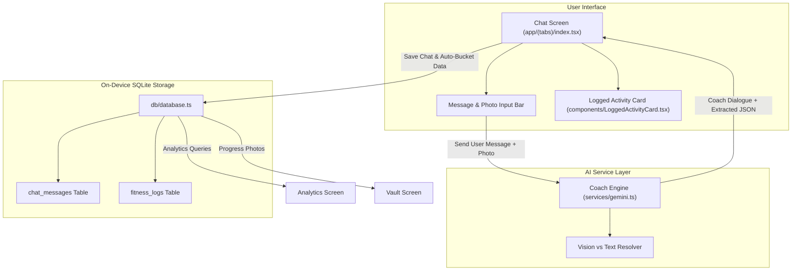

# Conversational Chat Session & Smart Bucketing Implementation Plan

> **For agentic workers:** REQUIRED SUB-SKILL: Use superpowers:subagent-driven-development to implement this plan task-by-task. Steps use checkbox (`- [ ]`) syntax for tracking.

**Goal:** Transform the main Fuel logging experience into a conversational AI Coach chat session where users can freely type text and attach photos, with Gemini 1.5 Flash automatically extracting and bucketing the data into Nutrition, Workouts, Body Weight, Recovery, and Progress Vault while providing real-time coaching dialogue.

**Architecture:** A dual-output conversational engine extracts structured entity payloads from natural user dialogue while generating personalized coach feedback. Extracted data is seamlessly persisted to SQLite (`chat_messages` and `fitness_logs` tables), keeping Analytics and the Progress Vault continuously up to date.

**Architecture Diagram:**



**Tech Stack:** React Native (Expo SDK 52), TypeScript, Google Gemini 1.5 Flash API, Expo SQLite, Expo Image Picker, Expo Haptics, Lucide React Native, Jest.

**Spec:** [`docs/superpowers/specs/2026-10-03-conversational-chat-logging-design.md`](file:///D:/Project/fitness-tracker/docs/superpowers/specs/2026-10-03-conversational-chat-logging-design.md)

## Global Constraints
- 100% on-device local SQLite and filesystem storage without cloud server dependencies.
- Model ordering must prioritize `gemini-1.5-flash` and route photos only to vision-capable models.
- Preserve backward compatibility for existing `fitness_logs` queries, Analytics aggregations, and Vault photos.
- All tests must pass with 0 failures (`npm.cmd test`), and TypeScript typecheck must remain clean (`npx.cmd tsc --noEmit`).

---

### Task 1: Type Definitions & SQLite Database Chat Layer

**Files:**
- Modify: [`types/fitness.ts`](file:///D:/Project/fitness-tracker/types/fitness.ts)
- Modify: [`db/database.ts`](file:///D:/Project/fitness-tracker/db/database.ts)
- Test: [`tests/database.test.ts`](file:///D:/Project/fitness-tracker/tests/database.test.ts)

**Interfaces:**
- Produces: `ChatExtractedData`, `ChatMessage`, `CoachAnalysisResponse` types; database methods `saveChatMessage(msg)`, `getChatMessages()`, `clearChatMessages()`, `saveLogFromExtractedData(extracted, imageUri)`.

- [ ] **Step 1: Write failing database unit tests**

```typescript
// in tests/database.test.ts
it('saves, retrieves, and clears chat messages in SQLite', async () => {
  const msgId = await saveChatMessage({
    sender: 'user',
    text: 'Ate 3 eggs and toast for breakfast',
    image_uri: null,
    extracted_data: null,
  });
  expect(msgId).toBeGreaterThan(0);

  const messages = await getChatMessages();
  expect(messages.length).toBeGreaterThan(0);
  expect(messages[0].text).toBe('Ate 3 eggs and toast for breakfast');

  await clearChatMessages();
  const cleared = await getChatMessages();
  expect(cleared.length).toBe(0);
});
```

- [ ] **Step 2: Run test to verify it fails**
Run: `npm.cmd test tests/database.test.ts`
Expected: FAIL with `saveChatMessage is not a function`.

- [ ] **Step 3: Implement types and SQLite chat methods**
Update `types/fitness.ts` and `db/database.ts` with `chat_messages` table creation and helper queries.

- [ ] **Step 4: Run test to verify it passes**
Run: `npm.cmd test tests/database.test.ts`
Expected: PASS

- [ ] **Step 5: Commit**
```bash
git add types/fitness.ts db/database.ts tests/database.test.ts
git commit -m "feat(db): add chat_messages schema and persistence methods"
```

---

### Task 2: Gemini Conversational Coach & Entity Extractor Service

**Files:**
- Modify: [`services/gemini.ts`](file:///D:/Project/fitness-tracker/services/gemini.ts)
- Test: [`tests/gemini.test.ts`](file:///D:/Project/fitness-tracker/tests/gemini.test.ts)

**Interfaces:**
- Consumes: `getApiKey()`, `getAvailableGeminiModels()`
- Produces: `sendChatMessageToCoach(message, imageUri, history)` returning `CoachAnalysisResponse`

- [ ] **Step 1: Write failing tests for conversational chat extraction**

```typescript
// in tests/gemini.test.ts
it('sends chat message to coach and extracts structured bucketed data', async () => {
  await setApiKey('test-key');
  const response = await sendChatMessageToCoach(
    'Ate 3 scrambled eggs, 1 slice toast. Did leg workout and weighed 78.5kg.'
  );
  expect(response.coach_response).toBeDefined();
  expect(response.extracted_data.has_data).toBe(true);
  expect(response.extracted_data.nutrition?.protein_g).toBeGreaterThan(0);
  expect(response.extracted_data.weight_kg).toBe(78.5);
});
```

- [ ] **Step 2: Run test to verify it fails**
Run: `npm.cmd test tests/gemini.test.ts`
Expected: FAIL with `sendChatMessageToCoach is not a function`.

- [ ] **Step 3: Implement `sendChatMessageToCoach` in `services/gemini.ts`**
Implement the structured coach prompt, history chaining, response JSON schema parsing, and model cascade.

- [ ] **Step 4: Run test to verify it passes**
Run: `npm.cmd test tests/gemini.test.ts`
Expected: PASS

- [ ] **Step 5: Commit**
```bash
git add services/gemini.ts tests/gemini.test.ts
git commit -m "feat(gemini): add conversational coach dialogue and entity extractor"
```

---

### Task 3: Interactive Logged Activity Card Component

**Files:**
- Create: [`components/LoggedActivityCard.tsx`](file:///D:/Project/fitness-tracker/components/LoggedActivityCard.tsx)
- Test: [`tests/components.test.tsx`](file:///D:/Project/fitness-tracker/tests/components.test.tsx)

**Interfaces:**
- Consumes: `ChatExtractedData` from `types/fitness.ts`
- Produces: `<LoggedActivityCard data={extractedData} />`

- [ ] **Step 1: Write failing test for LoggedActivityCard**

```typescript
// in tests/components.test.tsx
it('renders LoggedActivityCard with nutrition, workout, weight, and recovery badges', () => {
  const mockData: ChatExtractedData = {
    has_data: true,
    nutrition: { meal_type: 'Breakfast', calories: 450, protein_g: 35, carbs_g: 40, fat_g: 15 },
    workout: { workout_notes: 'Chest and triceps' },
    weight_kg: 78.5,
    recovery: { wind_down: '8h restful sleep' },
  };
  const element = <LoggedActivityCard data={mockData} />;
  expect(element).toBeDefined();
});
```

- [ ] **Step 2: Run test to verify it fails**
Run: `npm.cmd test tests/components.test.tsx`
Expected: FAIL with module not found.

- [ ] **Step 3: Implement `LoggedActivityCard.tsx`**
Create clean glass-styled badge indicators for 🥗 Nutrition, 🏋️ Workout, ⚖️ Weight, 🧘 Recovery, and 📸 Vault.

- [ ] **Step 4: Run test to verify it passes**
Run: `npm.cmd test tests/components.test.tsx`
Expected: PASS

- [ ] **Step 5: Commit**
```bash
git add components/LoggedActivityCard.tsx tests/components.test.tsx
git commit -m "feat(ui): add LoggedActivityCard component for chat message badges"
```

---

### Task 4: Main Conversational Chat Log Screen

**Files:**
- Modify: [`app/(tabs)/index.tsx`](file:///D:/Project/fitness-tracker/app/(tabs)/index.tsx)
- Modify: [`tests/components.test.tsx`](file:///D:/Project/fitness-tracker/tests/components.test.tsx)

**Interfaces:**
- Consumes: `sendChatMessageToCoach`, `saveChatMessage`, `getChatMessages`, `clearChatMessages`, `saveLogEntry`, `savePhotoLocally`
- Produces: Complete conversational chat interface on the Log tab.

- [ ] **Step 1: Write tests for Chat LogScreen rendering and interactions**

```typescript
// in tests/components.test.tsx
it('renders LogScreen with conversational chat header, message list, and input bar', () => {
  const element = <LogScreen />;
  expect(element).toBeDefined();
});
```

- [ ] **Step 2: Run test to verify current state**
Run: `npm.cmd test tests/components.test.tsx`

- [ ] **Step 3: Implement Chat Screen in `app/(tabs)/index.tsx`**
  - Add auto-scrolling `FlatList` of messages with user right-aligned bubbles and coach left-aligned glass cards.
  - Render `<LoggedActivityCard />` inside coach bubbles when data is recognized.
  - Add photo attachment with thumbnail preview and remove button.
  - Implement auto-bucketing to SQLite `fitness_logs` table upon successful coach response.
  - Add clear chat history action in header.

- [ ] **Step 4: Run full test suite and verify typecheck**
Run: `npm.cmd test`
Run: `npx.cmd tsc --noEmit`
Expected: 100% tests passing, 0 TypeScript errors.

- [ ] **Step 5: Commit**
```bash
git add "app/(tabs)/index.tsx" tests/components.test.tsx
git commit -m "feat(chat): implement conversational AI coach chat session and auto-bucketing"
```

---

### Task 5: Build Verification & EAS Android Preview Build

- [ ] **Step 1: Run comprehensive verification command**
Run: `npm.cmd test && npx.cmd tsc --noEmit`
- [ ] **Step 2: Trigger EAS Android Preview Build**
Run: `npx.cmd --package eas-cli eas build -p android --profile preview --non-interactive`
- [ ] **Step 3: Deliver installable APK URL & summary to user**
